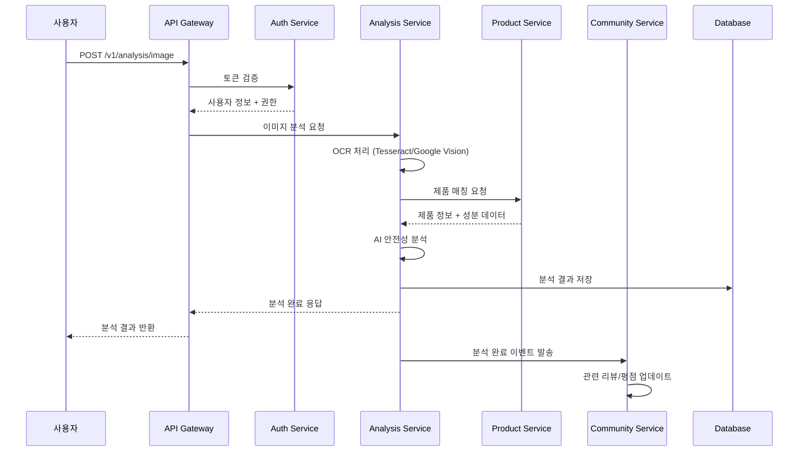
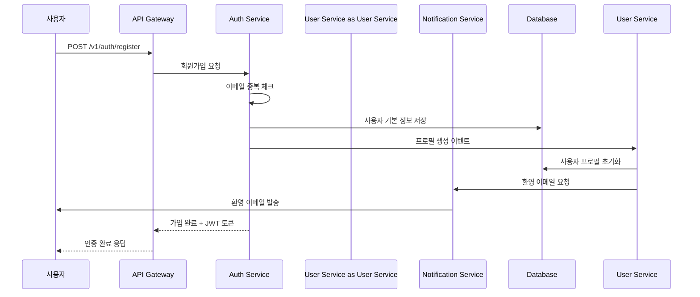

# 🔌 API 설계 & 데이터 플로우

## API Gateway 엔드포인트 설계

### 🎯 RESTful API 표준 구조
```
https://api.cosmicscan.com/v1/{service}/{resource}

예시:
POST /v1/analysis/image          # 이미지 분석
GET  /v1/user/profile            # 사용자 프로필
POST /v1/community/review        # 리뷰 작성  
GET  /v1/product/search          # 제품 검색
```

### 🔐 인증 & 권한 체계
```typescript
// JWT 토큰 구조
interface JWTPayload {
  sub: string;           // 사용자 ID
  tenant_type: 'b2c' | 'b2b' | 'admin';
  role: 'user' | 'premium' | 'brand' | 'admin';
  permissions: string[]; // 세부 권한
  exp: number;          // 만료 시간
}

// API 요청 헤더
Authorization: Bearer <jwt_token>
X-Tenant-Type: b2c|b2b|admin
X-API-Version: v1
```

## 📋 서비스별 API 명세

### Analysis Service APIs
```typescript
// POST /v1/analysis/image
interface AnalyzeImageRequest {
  image: File | string;        // 이미지 파일 또는 Base64
  user_preferences?: {
    skin_type: string;
    allergies: string[];
    concerns: string[];
  };
}

interface AnalyzeImageResponse {
  analysis_id: string;
  ocr_result: {
    ingredients: string[];
    brand: string;
    product_name: string;
    confidence: number;
  };
  safety_analysis: {
    overall_score: number;      // 1-100
    risk_ingredients: Array<{
      name: string;
      risk_level: 'low' | 'medium' | 'high';
      reason: string;
    }>;
  };
  personalized_insights: {
    recommendation: 'recommended' | 'caution' | 'avoid';
    reasons: string[];
    alternatives?: string[];
  };
}

// GET /v1/analysis/history
interface AnalysisHistoryResponse {
  analyses: Array<{
    id: string;
    product_name: string;
    analyzed_at: string;
    overall_score: number;
    thumbnail_url: string;
  }>;
  pagination: {
    page: number;
    limit: number;
    total: number;
  };
}
```

### User Service APIs
```typescript
// GET /v1/user/profile
interface UserProfile {
  id: string;
  email: string;
  display_name: string;
  avatar_url?: string;
  skin_profile: {
    skin_type: 'oily' | 'dry' | 'combination' | 'sensitive';
    concerns: string[];
    allergies: string[];
    age_range: string;
  };
  subscription: {
    plan: 'free' | 'premium' | 'vip';
    status: 'active' | 'cancelled' | 'expired';
    expires_at?: string;
  };
  preferences: {
    language: string;
    notifications: boolean;
    privacy_level: 'public' | 'private';
  };
}

// PUT /v1/user/profile
interface UpdateProfileRequest {
  display_name?: string;
  skin_profile?: Partial<UserProfile['skin_profile']>;
  preferences?: Partial<UserProfile['preferences']>;
}
```

### Community Service APIs
```typescript
// POST /v1/community/review
interface CreateReviewRequest {
  product_id: string;
  rating: number;          // 1-5
  title: string;
  content: string;
  photos?: File[];
  tags?: string[];
  is_verified_purchase?: boolean;
}

// GET /v1/community/reviews
interface ReviewsResponse {
  reviews: Array<{
    id: string;
    user: {
      display_name: string;
      avatar_url: string;
      skin_type: string;
    };
    rating: number;
    title: string;
    content: string;
    photos: string[];
    helpful_count: number;
    created_at: string;
  }>;
  stats: {
    average_rating: number;
    total_reviews: number;
    rating_distribution: Record<string, number>;
  };
}

// POST /v1/community/vote
interface VoteRequest {
  target_type: 'review' | 'comment';
  target_id: string;
  vote_type: 'helpful' | 'not_helpful' | 'funny';
}
```

### Product Service APIs
```typescript
// GET /v1/product/search
interface ProductSearchRequest {
  q?: string;              // 검색어
  brand?: string;          // 브랜드 필터
  category?: string;       // 카테고리 필터
  ingredients?: string[];  // 포함 성분
  exclude_ingredients?: string[]; // 제외 성분
  min_rating?: number;     // 최소 평점
  sort?: 'relevance' | 'rating' | 'price' | 'newest';
  page?: number;
  limit?: number;
}

interface ProductSearchResponse {
  products: Array<{
    id: string;
    name: string;
    brand: string;
    category: string;
    image_url: string;
    average_rating: number;
    review_count: number;
    key_ingredients: string[];
    price_range?: string;
  }>;
  filters: {
    brands: string[];
    categories: string[];
    price_ranges: string[];
  };
  pagination: PaginationInfo;
}

// GET /v1/product/{id}/details
interface ProductDetails {
  id: string;
  name: string;
  brand: string;
  description: string;
  ingredients: Array<{
    name: string;
    function: string;
    safety_rating: number;
    allergen_info?: string;
  }>;
  certifications: string[];
  usage_instructions: string;
  warnings: string[];
  images: string[];
  reviews_summary: {
    average_rating: number;
    total_reviews: number;
    top_tags: string[];
  };
}
```

### Payment Service APIs (B2B 확장용)
```typescript
// POST /v1/payment/subscription
interface CreateSubscriptionRequest {
  plan_id: string;         // 'premium' | 'vip' | 'business_starter'
  payment_method: string;  // Stripe payment method ID
  billing_cycle: 'monthly' | 'yearly';
}

// GET /v1/payment/usage  
interface APIUsageResponse {
  current_period: {
    start_date: string;
    end_date: string;
    requests_made: number;
    requests_limit: number;
    overage_charges: number;
  };
  usage_breakdown: Array<{
    date: string;
    endpoint: string;
    requests: number;
  }>;
}
```

## 🔄 데이터 플로우 다이어그램

### 이미지 분석 플로우


### 사용자 등록 플로우  


## 🎛️ 이벤트 기반 아키텍처

### 이벤트 타입 정의
```typescript
// 도메인 이벤트 인터페이스
interface DomainEvent {
  id: string;
  type: string;
  version: string;
  timestamp: string;
  aggregate_id: string;
  data: Record<string, any>;
}

// 사용자 관련 이벤트
type UserEvents = 
  | 'user.registered'
  | 'user.profile_updated'  
  | 'user.subscription_changed'
  | 'user.deleted';

// 분석 관련 이벤트  
type AnalysisEvents =
  | 'analysis.completed'
  | 'analysis.failed'
  | 'ingredients.detected';

// 커뮤니티 관련 이벤트
type CommunityEvents = 
  | 'review.created'
  | 'review.updated'
  | 'comment.added'
  | 'vote.cast';
```

### 이벤트 발행/구독 패턴
```typescript
// Supabase Realtime을 활용한 이벤트 버스
class EventBus {
  private supabase = createClient(url, key);
  
  // 이벤트 발행
  async publish(event: DomainEvent) {
    await this.supabase
      .from('events')
      .insert(event);
    
    // Realtime으로 구독자들에게 즉시 전파
    this.supabase.channel('events')
      .send('event', event);
  }
  
  // 이벤트 구독
  subscribe(eventType: string, handler: (event: DomainEvent) => void) {
    this.supabase.channel('events')
      .on('event', (payload) => {
        if (payload.type === eventType) {
          handler(payload);
        }
      })
      .subscribe();
  }
}

// 사용 예시
const eventBus = new EventBus();

// 분석 완료 이벤트 발행
eventBus.publish({
  id: uuid(),
  type: 'analysis.completed',
  version: '1.0',
  timestamp: new Date().toISOString(),
  aggregate_id: analysisId,
  data: {
    user_id: userId,
    product_id: productId,
    safety_score: 85,
    risk_ingredients: ['fragrance']
  }
});
```

## 📊 데이터 일관성 & 트랜잭션 처리

### SAGA 패턴 구현
```typescript
// 분석 요청 SAGA 오케스트레이션
class AnalysisWorkflow {
  async execute(request: AnalyzeImageRequest) {
    const sagaId = uuid();
    
    try {
      // Step 1: 이미지 저장
      const imageUrl = await this.saveImage(request.image);
      
      // Step 2: OCR 처리  
      const ocrResult = await this.processOCR(imageUrl);
      
      // Step 3: 제품 매칭
      const productInfo = await this.matchProduct(ocrResult);
      
      // Step 4: 안전성 분석
      const safetyAnalysis = await this.analyzeSafety(
        productInfo, 
        request.user_preferences
      );
      
      // Step 5: 결과 저장
      const analysisResult = await this.saveAnalysis({
        ocrResult,
        productInfo,
        safetyAnalysis
      });
      
      return analysisResult;
      
    } catch (error) {
      // 보상 트랜잭션 실행
      await this.compensate(sagaId, error);
      throw error;
    }
  }
  
  private async compensate(sagaId: string, error: Error) {
    // 실패한 단계부터 역순으로 롤백
    // 이미지 삭제, 임시 데이터 정리 등
  }
}
```

### 읽기 모델 최적화 (CQRS)
```typescript
// 명령 모델 (쓰기 최적화)
interface WriteModels {
  users: UserAggregate;
  products: ProductAggregate; 
  analyses: AnalysisAggregate;
  reviews: ReviewAggregate;
}

// 쿼리 모델 (읽기 최적화)  
interface ReadModels {
  user_profiles: UserProfileView;
  product_catalog: ProductCatalogView;
  analysis_history: AnalysisHistoryView;
  community_feed: CommunityFeedView;
}

// 이벤트 핸들러로 읽기 모델 업데이트
class ReadModelUpdater {
  @EventHandler('analysis.completed')
  async onAnalysisCompleted(event: DomainEvent) {
    // analysis_history 읽기 모델 업데이트
    await this.updateAnalysisHistory(event.data);
    
    // user_profiles의 분석 통계 업데이트  
    await this.updateUserStats(event.data.user_id);
  }
}
```

---
*API 설계 & 데이터 플로우 v1.0 - 2025-09-18*
